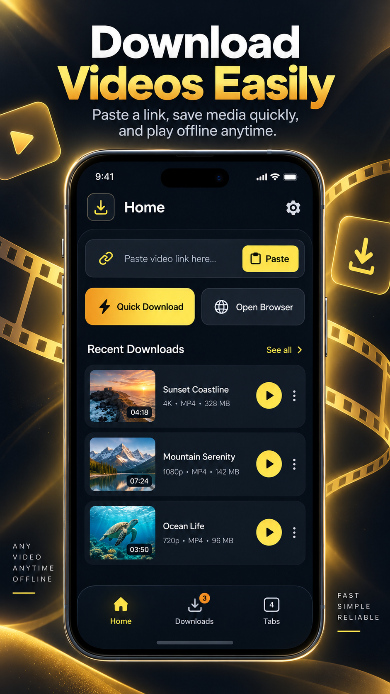
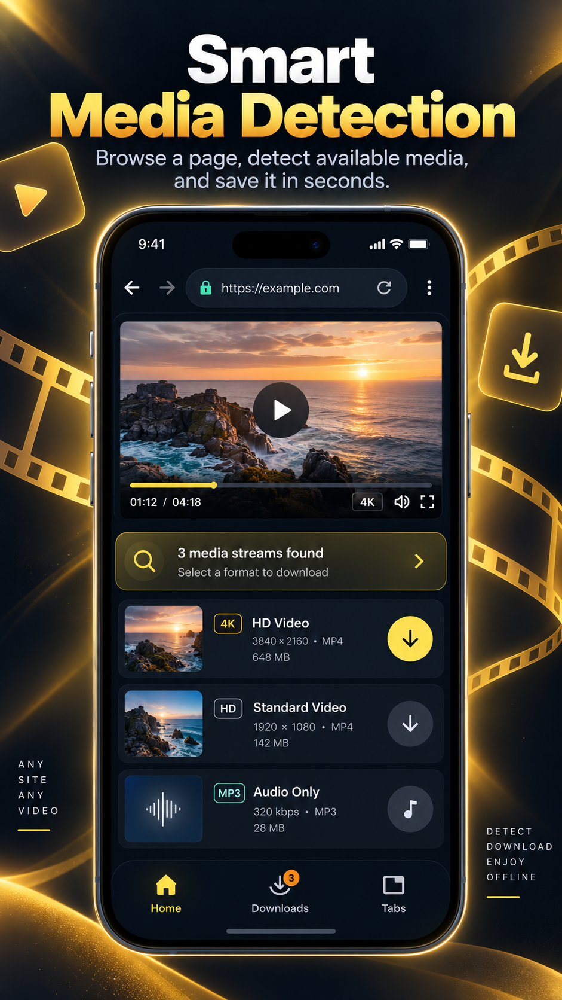
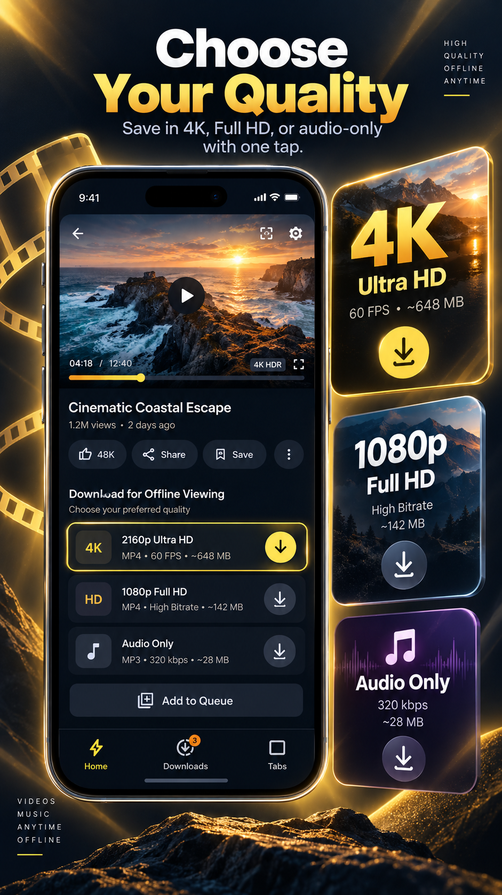
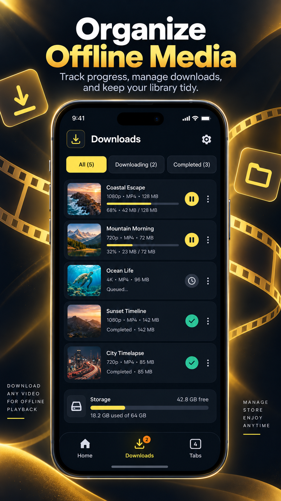
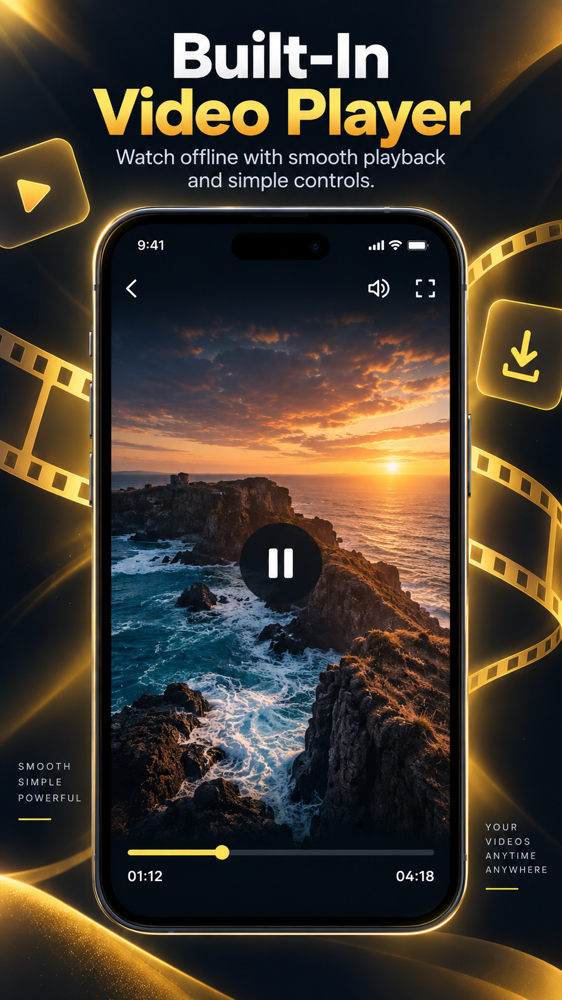
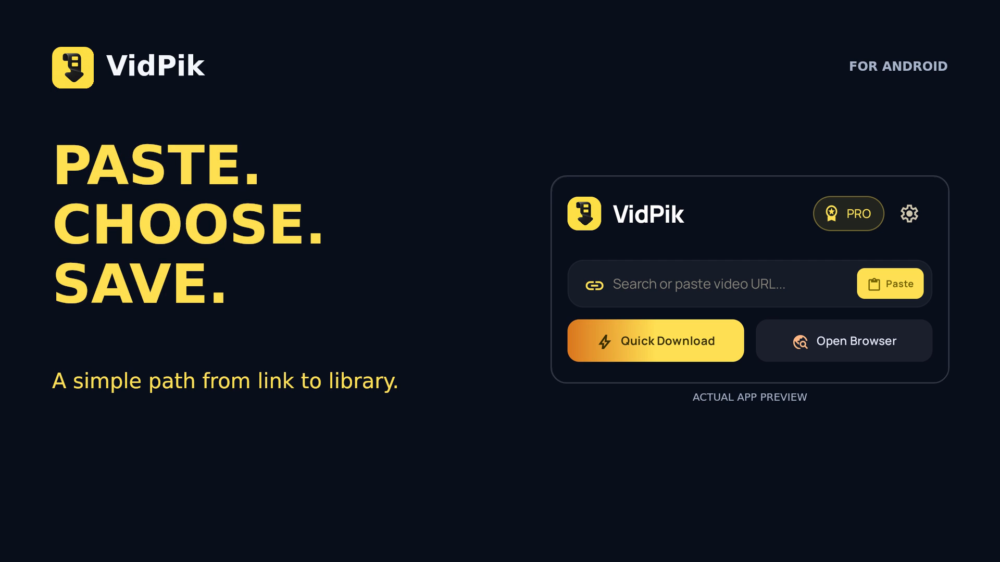
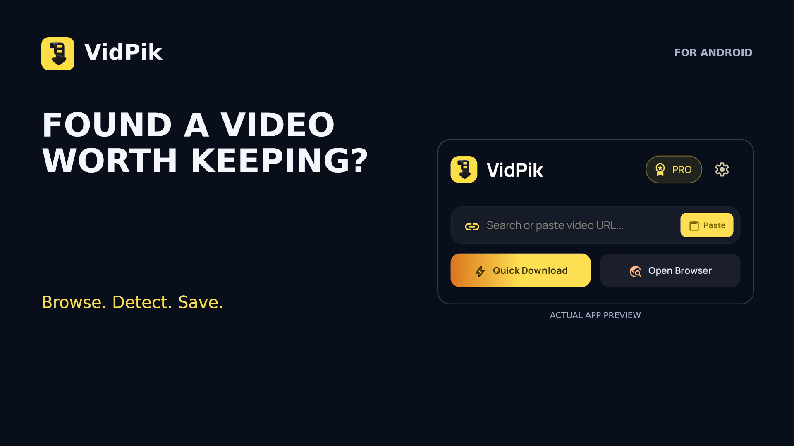
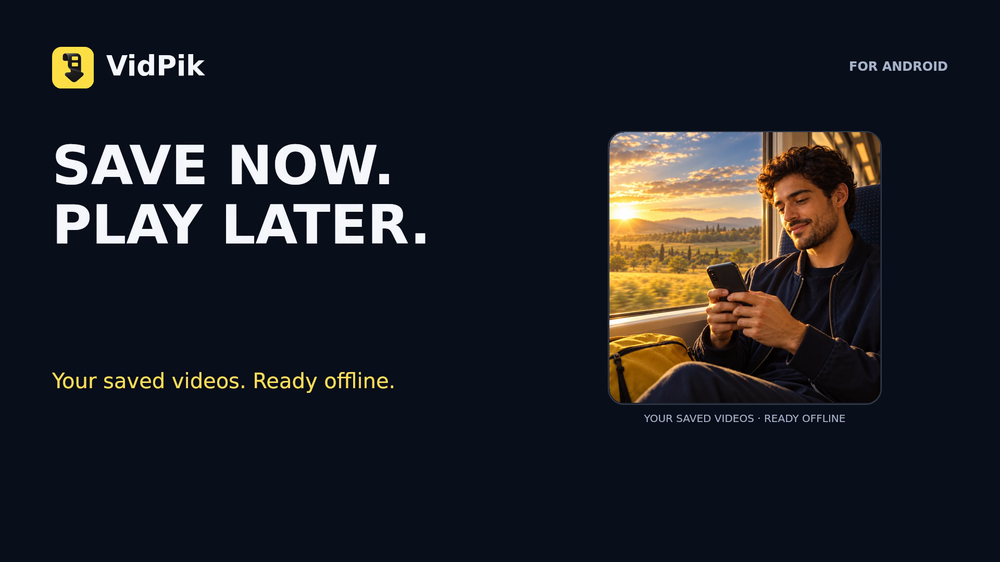

  

<h1 align="center">VidPik - Video Downloader &amp; player</h1>

<strong>Paste. Choose. Save. Play offline.</strong>

Your video links, downloads and offline playback — together in one Android app.

<h2 align="center"><a href="https://play.google.com/store/apps/details?id=com.mrdappworld.videodownloader">⬇ GET VIDPIK ON GOOGLE PLAY</a></h2>

  

<a href="#see-vidpik">Screenshots</a> · <a href="#watch-vidpik-in-action">Videos</a> · <a href="#three-simple-ways-to-start">How it works</a>

VidPik helps you save videos from supported sources and keep them ready for offline viewing. Paste a link, share a link to VidPik, or use the built-in browser to find available media. Choose a format, manage your downloads and play saved videos inside the app.

## Made for your offline collection

| Feature | What you can do |
| --- | --- |
| **Quick Download** | Paste a supported video link and choose an available download format. |
| **Share to VidPik** | Send a video link from another app to VidPik’s format-selection flow. |
| **Built-in browser** | Browse supported pages and inspect detected videos without switching apps. |
| **Quality and audio choices** | Pick from the formats available for your source, including HD, 4K or audio when supported. |
| **Download manager** | Follow progress and manage active and completed downloads. |
| **Built-in player** | Watch saved videos offline with playback controls in portrait or landscape. |
| **Private folder** | Keep selected saved media in a separate, protected area of the app. |
| **Your preferred look** | Choose a theme and one of the available app languages. |

Available formats depend on the source. 4K access may require Pro or an available rewarded unlock. The app contains ads and offers in-app purchases.

## See VidPik

  
  
  

  
  

## Watch VidPik in action

Three short videos. Each is available in portrait, square and landscape.

| Paste & choose | Browse & save | Save now, play later |
| :---: | :---: | :---: |
|  |  |  |
| [▶ Portrait](01-paste-choose-save.mp4) · [▶ Square](01-paste-choose-save-square.mp4) · [▶ Landscape](01-paste-choose-save-landscape.mp4) | [▶ Portrait](02-browse-detect-save.mp4) · [▶ Square](02-browse-detect-save-square.mp4) · [▶ Landscape](02-browse-detect-save-landscape.mp4) | [▶ Portrait](03-save-now-play-later.mp4) · [▶ Square](03-save-now-play-later-square.mp4) · [▶ Landscape](03-save-now-play-later-landscape.mp4) |

*15-second promotional edits. Visuals illustrate app features and flows; layouts and availability may vary by version. These are not real-time download-speed measurements.*

## Three simple ways to start

1. **Paste a link:** open VidPik → paste a supported video URL → Quick Download → choose a format → confirm.
2. **Share a link:** choose Share in another app → VidPik → choose a format → confirm.
3. **Browse a page:** open the built-in browser → play a supported video → tap the download button when media is detected → choose a format.

Find saved videos in Downloads, then open them in the built-in player whenever you want to watch offline.

<h2 align="center"><a href="https://play.google.com/store/apps/details?id=com.mrdappworld.videodownloader">DOWNLOAD VIDPIK FOR ANDROID</a></h2>

  

---

Published by **MRD APP WORLD**. Google Play currently lists this package as **Video Downloader & Player**.

Download only content you own or have permission to save. Source availability, formats and download speeds vary; protected media and some sites may not support downloading.

This repository is VidPik’s public promotional showcase. It contains product information and finished promotional images/videos only. **The application source code is not published here.**
